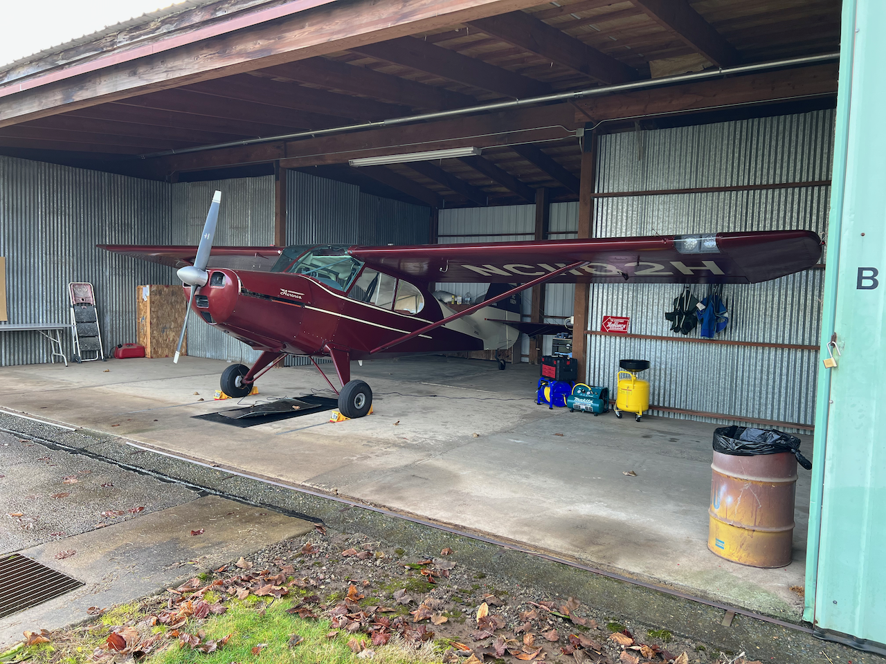

### Aircraft Checklist and AFM for N1182H 

This repo has a copy of the checklist and AFM I have developed and documented for use with the plane. 

**Files**

`./Checklist `

`./AFM`

### Aircraft Specifications

- **Make**: Aeronca

- **Model**: 15AC Sedan

- **Year Manufactured**: 1948

- **ICAO Code**: AR15
- **Serial Number**: 15AC-192
- **Mode S Code (base 8 / Oct)**: 50046221
- **Mode S Code (Base 16 / Hex)**: A04C91
- **Engine**: Continental C145 SERIES

### LEGAL DISCLAIMER 

This documentation is curated and gathered in an attempt to preserve and create reference material for an older legacy aircraft. This is not meant to replace a formal aircraft AFM or documentation where it does exist. The reality is that these older aircraft are no longer original due to age, retrofit, and original documentation may not have reasonably survived this long or, in some instances, existed. Pilots must practice proper judgment validating safe legal operating procedures and performance figures for a specific example of this aircraft in accordance with your regulatory requirements. N1182H attempts to comply with the USA FAA's FAR regulations. This is not to be confused with a formal MEL, but a good-faith attempt to document and improve operating procedures. 

TL:DR; Be Safe, Be Legal, Be Smart, Don't Sue Me.
